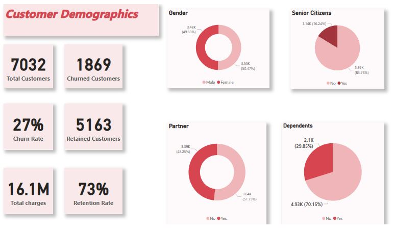
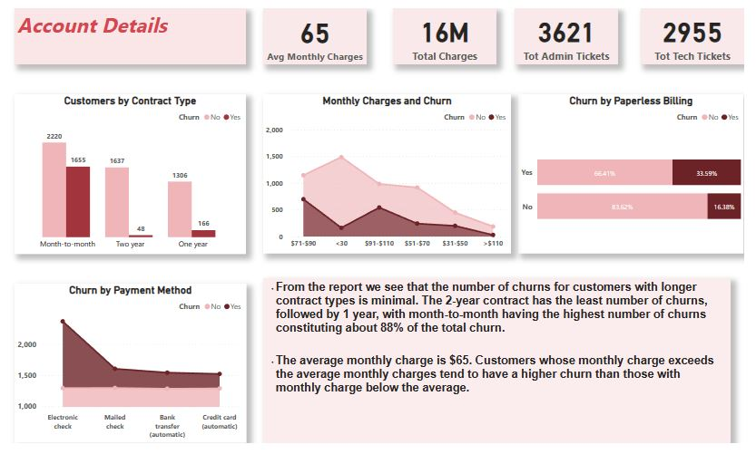
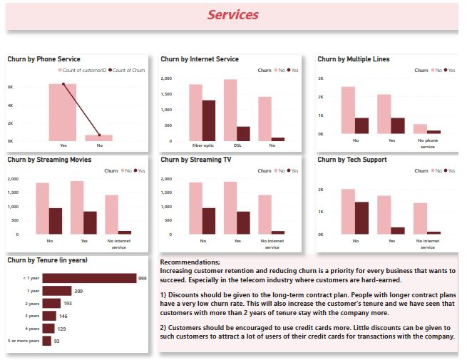

# PhoneNow Telecom: A Customer Retention Analysis

## Introduction
PhoneNow Telecom is a telecommunicationin company that needs help with its customer retention data. The organization has a large dataset on its customers but their team is unsure how to effectively analyze it to help optimize its customer retention strategy. 
This project uses Power BI to analyze the dataset provided by PhoneNow and derive insights for the Retention Manager at PhoneNow. 

**_Disclaimer_** : This is an imaginary company that was made up for the purpose of the PWC Power BI Virtual Internship.

## Problem Statement
Customer Retention is a top priority to every business and PhoneNow is no exception. To help the retention department to come up with good customer retention strategies, 
Develop a dashboard for the Retention Manager. It should answer the following business questions;
   - What are the trends in the underlying data?
   - How many customers have churned?
   - How does the various telecom services affect churn?
   - Provide Recommendations to the Retention team.

## Skills/ Concepts Demonstrated
The following Power BI features were incorporated;
- DAX
- Quick measures
- Calculated Columns
- Conditional columns

## Data Quality Assesment
The image below is the data quality assessment report that was made before proceeding with analysis.

## Modelling
Only one dataset was provided; Customer Churn Dataset. Unnecessary data was removed and analysis began. There was no need for data modeling since we had just one dataset and had all data needed in that dataset. Below is a shot of the data model used in this project.

## Visualization
The report comprises 3 pages;
1. Customer Demographics

From the report above, we can see that PhoneNow about 50.5% of its customers being females which is only slightly higher than the number of males. Out of the total number of customers, about 16% of them are senior citizens which means the larger population of customers are youths or people in the working class. Also, about 70% of customers have no dependents.

2. Account Details 

3. Telecom Services

Click on the link :point_right: [here](https://app.powerbi.com/groups/me/reports/5feb0f82-e592-44b3-8b5c-8bb0bc7c7050/ReportSection24a2f56d77737b3323cb) to interact with the report.

## Conclusion
Below is the content of the email that was sent to the Retention Manager at PhoneNow concerning the report generated from the given dataset.

## Thank You For Reading To The End :smile:

